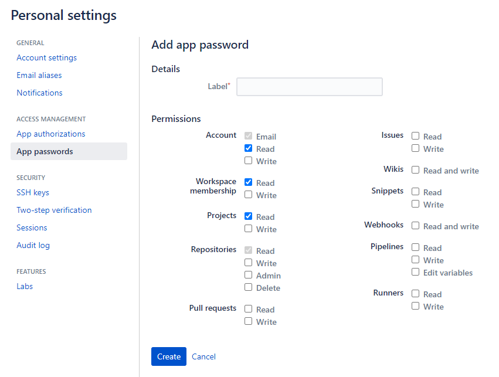
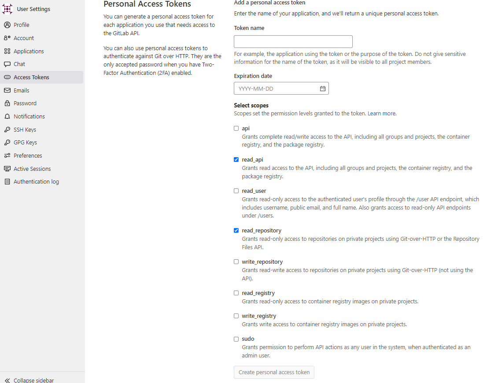

# gb.py

Клонирует на локальную машину все доступные из аккаунта пользователя репозитории, формирует json список репозиториев, отсортированный по проектам, загружает список репозиториев в дерево конфигурации smartgit с сортировкой по проектам. Умеет работать с серверами Bitbucket и Gitlab.

# не умеет

1. Работать с репозиториями по ssh.

# получение ключей авторизации

## Bitbucket cloud api key

Зайти в настройки аккаунта Bitbucket по адресу https://bitbucket.org/account/settings/app-passwords/new и создать ключ, выставив права следующим образом:

## Gitlab server api key

Зайти в настройки аккаунта Gitlab по адресу https://<адрес сервера>/profile/personal_access_tokens и создать ключ, выставив права следующим образом:

# примеры использования

Обновление репозиториев с Bitbucket:

~~~
python gd.py --json bb_list.json --yml c:\Users\<winuser>\AppData\Roaming\syntevo\SmartGit\21.1\repository-grouping.yml --yml-group <groupname> --base-path C:\git\bb --replace-proj "Untitled project:noproj,test:test" bitbucket-cloud --username <username> --app-key <applicationkey>
~~~

Обновление репозиториев с Gitlab:

~~~
python gd.py --json gl_list.json --yml c:\Users\<winuser>\AppData\Roaming\syntevo\SmartGit\21.1\repository-grouping.yml --yml-group <groupname> --base-path C:\git\gl gitlab-server --server-url https://<servername> --token <applicationkey>
~~~

# Автоматическая справка

~~~
usage: Git updater [-h] [--json <filename.json>] [--yml <c:\Users\<username>\AppData\Roaming\syntevo\SmartGit\21.1\repository-grouping.yml>] [--yml-group <groupname>] --base-path <dirname> [--no-update] [--win-cred]
                   [--try-cnt <int>] [--replace-proj <First origin name:alias1,Second name:alias2>]
                   {bitbucket-cloud,gitlab-server} ...

Клонирует на локальную машину все доступные из аккаунта пользователя репозитории, формирует json список репозиториев, отсортированный по проектам, загружает список репозиториев в дерево конфигурации smartgit с сортировкой по проектам.

positional arguments:
  {bitbucket-cloud,gitlab-server}
    bitbucket-cloud     Работаем с облачным сервером Bitbucket.
    gitlab-server       Работаем с сервером Gitlab.

optional arguments:
  -h, --help            show this help message and exit
  --json <filename.json>
                        Сформировать и записать в файл json информацию обо всех найденных репозиториях. Каждый элемнт списка включает в себя: название проекта, название репозитория, путь к репозиторию на сервере, описание репозитория.
  --yml <c:\Users\<username>\AppData\Roaming\syntevo\SmartGit\21.1\repository-grouping.yml>
                        Путь к файлу конфигурации Smartgit. Файл, в котором будут созданы группы (по имени проекта), содержащие найденные репозитории. Все созданные группы будут помещены в родительскую группу.
  --yml-group <groupname>
                        Название родительской группы репозиториев в файле конфигурации Smartgit.
  --base-path <dirname>
                        Прописываем абсолютный путь к папке, в которую будут клонированы найденные репозитории. В этой папке будут созданы подпапки по именам проектов и в них будут находиться папки с репозиториями. Если репозитории там уже есть, то они будут обновлены с сервера.
  --no-update           Не обновляем репозитории. Только получаем список репозиториев и сохраняем его в json файл или конфигурацию Smartgit.
  --win-cred            Изменить хранилище паролей git на системный менеджер учетных записей Windows. Выполняет команду "git config --global credential.helper wincred". Это позволяет избежать запроса логина и пароля при обновлении каждого репозитория, если авторизация в git была настроена некорректно.
  --try-cnt <int>       Количество попыток успешного завершения скрипта. Актуально при большом количестве репозиториев или плохой связи.
  --replace-proj <First origin name:alias1,Second name:alias2>
                        Список имен проектов, которые будут переименованы в локальной версии. Синтаксис: "orig-name1:alias1,Untitled project:noproject". Оригинальные и новые значения разделены между собой двоеточием (без пробелов), пары значений отделены друг от друга запятыми (без пробелов). Позволяет избежать проблем в случаях, когда имена проектов содержат недопустимые символы (пробелы, например).
~~~
